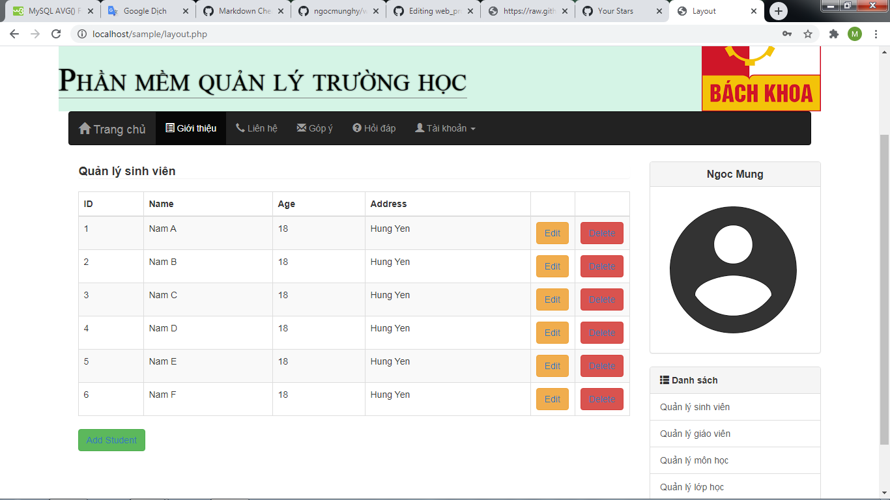

Getting started
===============

1. Make sure you've installed `WAMP`,`LAMP`or`XAMPP` on your system.<br>
If you don't have any of these on your system, then download it from:
  - [WAMPSERVER](https://www.wampserver.com/en/) 
  - [LAMPSERVER](https://bitnami.com/stack/lamp/installer) 
  - [XAMPP](https://www.apachefriends.org/download.html) ( I'm using this )

2. Make a folder named `sms` in xampp\htocs

3. Access `sms` folder you've created, open Git Bash and git clone this project:
```
$ git clone https://github.com/ngocmunghy/my_first_web_project.git
```
4. Open your browser, type `http://localhost/phpmyadmin/` on the address-bar. Create a new database named `sms1` and import `db_sms.sql` file from `sms` folder into this database
5. Type `http://localhost/sms/` on the address-bar. This will lead you to Login GUI.
6. Type `admin@gmail.com` and `123456` to access, or you can create a new account for your own. After logging in successfully, the window you will see is something like this:

---
### This project is not done yet, I will upgrade it soon! If you're interested, contact and join with me via:
> Facebook: https://www.facebook.com/ngocmunghy/ <br>
> Email: mung09021999@gmail.com
